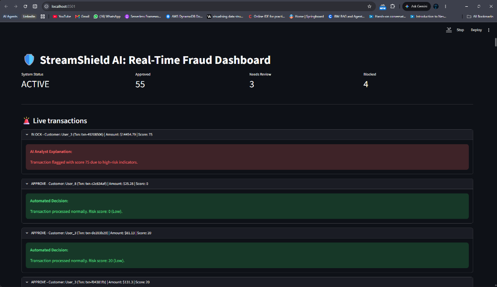
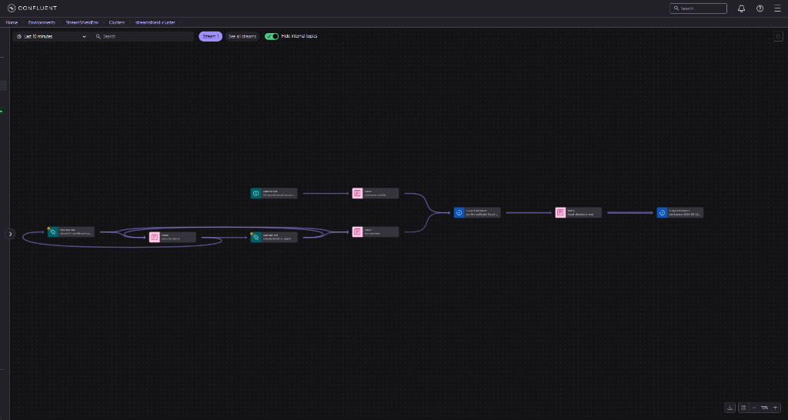
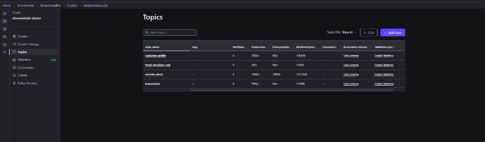
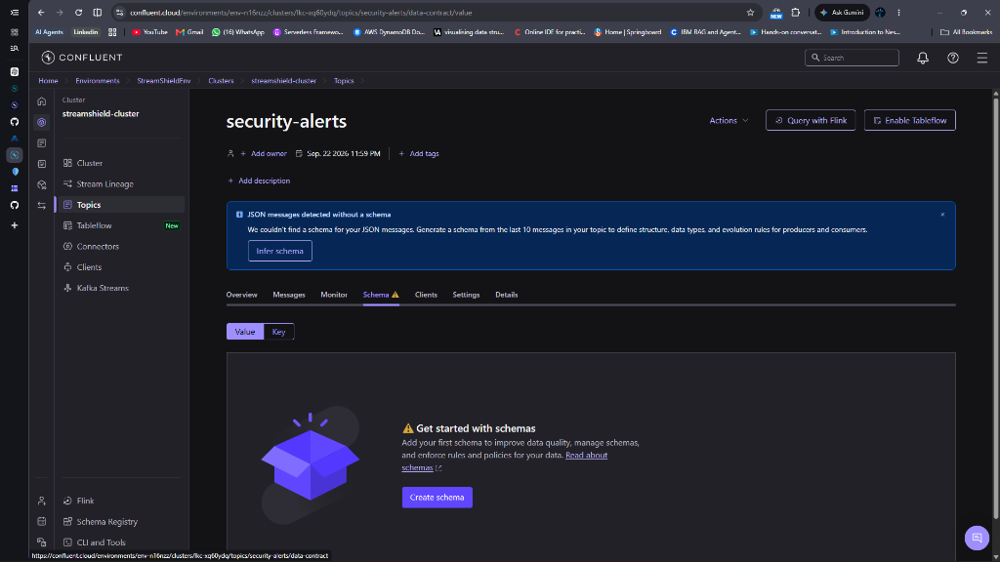
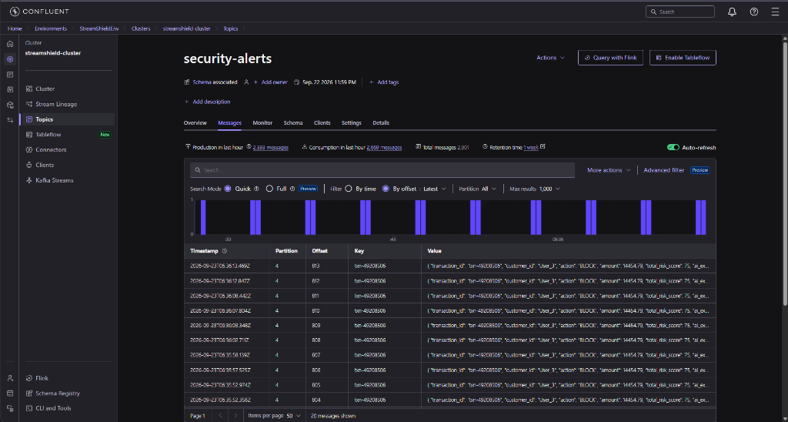
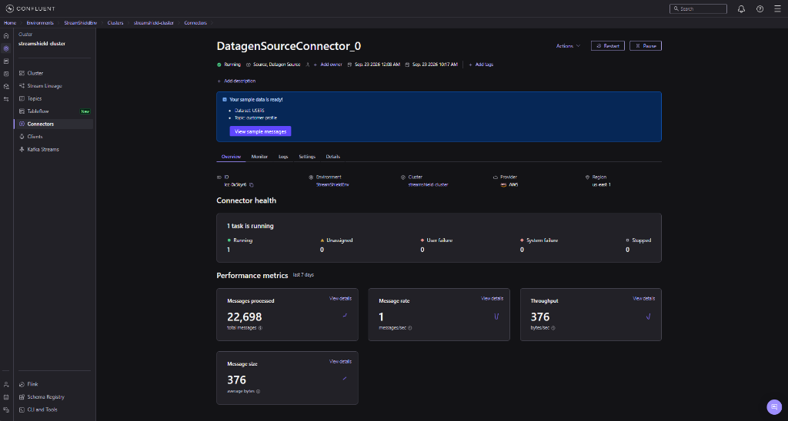
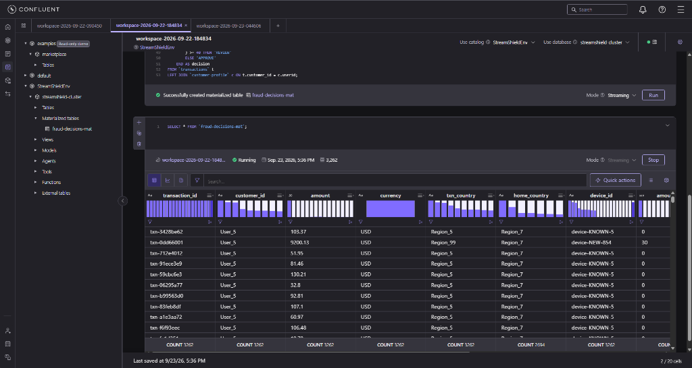

# StreamShield AI: Real-Time Fraud Prevention with Confluent & Gemini

**Use case:** Picture a global financial institution. Millions of transactions stream in every second. We need two things live: deterministic rule-based fraud detection (a **materialized table**) to instantly block bad actors, and asynchronous GenAI analysis to explain *why* the transaction was flagged for human security analysts.

**Why it matters:** Security analysts are overwhelmed by alerts. Deterministic rules are fast but lack context, while LLMs are smart but too slow to sit on the critical enforcement path. This architecture combines the best of both: 0-latency enforcement via Flink + automated AI investigations.

> [!NOTE]
> This project was built for the Confluent Hackathon.



---

## 1. Architecture Overview

Our pipeline uses Confluent Cloud for streaming and Apache Flink for real-time stream processing, connected to Google's Gemini LLM.



1. **Transaction Source:** A Python producer simulates live credit card transactions (`transactions` topic).
2. **Customer Profiles:** A Confluent Datagen Connector streams customer data (`customer-profile` topic).
3. **Flink SQL:** A Materialized Table joins transactions with profiles to compute risk scores in real-time, outputting to `fraud-decisions-mat`.
4. **AI Agent:** A Python consumer reads the Flink decisions. It immediately publishes a "Pending Analysis" alert to `security-alerts`, then queries Gemini for a human-readable explanation, and updates the alert.
5. **Live Dashboard:** A Streamlit app consumes `security-alerts` to display a live, deduplicated view of fraud incidents.

---

## 2. Setting Up Confluent Cloud

### Create the Topics
You will need the following topics:
- `transactions` (Partitions: 6)
- `customer-profile` (Partitions: 6)
- `security-alerts` (Partitions: 6)
- `fraud-decisions-mat` (Partitions: 6)



> [!TIP]
> For `security-alerts`, navigate to the Confluent UI, look at the topic messages, and click **Infer Schema** to automatically generate a JSON Schema Data Contract!
> 
> 
>
> You can also view the rich AI-enriched JSON payload flowing through in real-time:
> 

### Generate Customer Data
1. Go to **Connectors** and add a **Sample Data (Datagen)** connector.
2. Select the **Users** template but set the output topic to `customer-profile`.
3. Launch it.



---

## 3. Real-Time Fraud Detection with Flink

We use Apache Flink to calculate risk scores. The score increases if the transaction amount is high, if the transaction country differs from the user's home country, or if the device is new.

Open the **Flink SQL Workspace** and run the following:

```sql
CREATE MATERIALIZED TABLE `fraud-decisions-mat` (
    `transaction_id` STRING NOT NULL,
    `customer_id` STRING,
    `amount` DOUBLE,
    `currency` STRING,
    `txn_country` STRING,
    `home_country` STRING,
    `device_id` STRING,
    `amount_risk` INT,
    `location_risk` INT,
    `device_risk` INT,
    `total_risk_score` INT,
    `decision` STRING,
    PRIMARY KEY (`transaction_id`) NOT ENFORCED
) WITH (
    'changelog.mode' = 'upsert'
) AS
SELECT 
    t.transaction_id,
    t.customer_id,
    t.amount,
    t.currency,
    t.country AS txn_country,
    c.regionid AS home_country,
    t.device_id,
    -- Amount Risk Rule
    CASE WHEN t.amount > 5000 THEN 30 ELSE 0 END AS amount_risk,
    -- Location Risk Rule
    CASE WHEN t.country <> c.regionid THEN 20 ELSE 0 END AS location_risk,
    -- Device Risk Rule
    CASE WHEN t.device_id LIKE '%NEW%' THEN 25 ELSE 0 END AS device_risk,
    -- Total Score
    (
        (CASE WHEN t.amount > 5000 THEN 30 ELSE 0 END) +
        (CASE WHEN t.country <> c.regionid THEN 20 ELSE 0 END) +
        (CASE WHEN t.device_id LIKE '%NEW%' THEN 25 ELSE 0 END)
    ) AS total_risk_score,
    -- Deterministic Decision Logic
    CASE 
        WHEN (
            (CASE WHEN t.amount > 5000 THEN 30 ELSE 0 END) +
            (CASE WHEN t.country <> c.regionid THEN 20 ELSE 0 END) +
            (CASE WHEN t.device_id LIKE '%NEW%' THEN 25 ELSE 0 END)
        ) >= 70 THEN 'BLOCK'
        WHEN (
            (CASE WHEN t.amount > 5000 THEN 30 ELSE 0 END) +
            (CASE WHEN t.country <> c.regionid THEN 20 ELSE 0 END) +
            (CASE WHEN t.device_id LIKE '%NEW%' THEN 25 ELSE 0 END)
        ) >= 40 THEN 'REVIEW'
        ELSE 'APPROVE'
    END AS decision
FROM `transactions` t
LEFT JOIN `customer-profile` FOR SYSTEM_TIME AS OF t.`$rowtime` AS c
    ON t.customer_id = c.userid;
```

Once executed, Flink instantly provisions a continuous running job that materializes these results into a new `fraud-decisions-mat` topic. You can query this newly created table to watch the real-time evaluated transactions flow in:



---

## 4. Run the Python Pipeline

Clone this repository and install dependencies:
```bash
pip install confluent-kafka streamlit google-generativeai python-dotenv
```

1. **Configure Environment Variables:**
   Copy `.env.example` to `.env` and fill in your Confluent API keys, bootstrap server, and Gemini API key.

2. **Start the Transaction Producer:**
   Simulates a realistic stream of transactions (20% severe fraud, 10% mild fraud).
   ```bash
   python transaction_producer.py
   ```

3. **Start the AI Agent:**
   Consumes Flink decisions, publishes immediate deterministic alerts, and fetches async AI explanations.
   ```bash
   python ai_agent.py
   ```

4. **Launch the Dashboard:**
   A real-time Streamlit UI to monitor the security alerts.
   ```bash
   streamlit run dashboard.py
   ```
